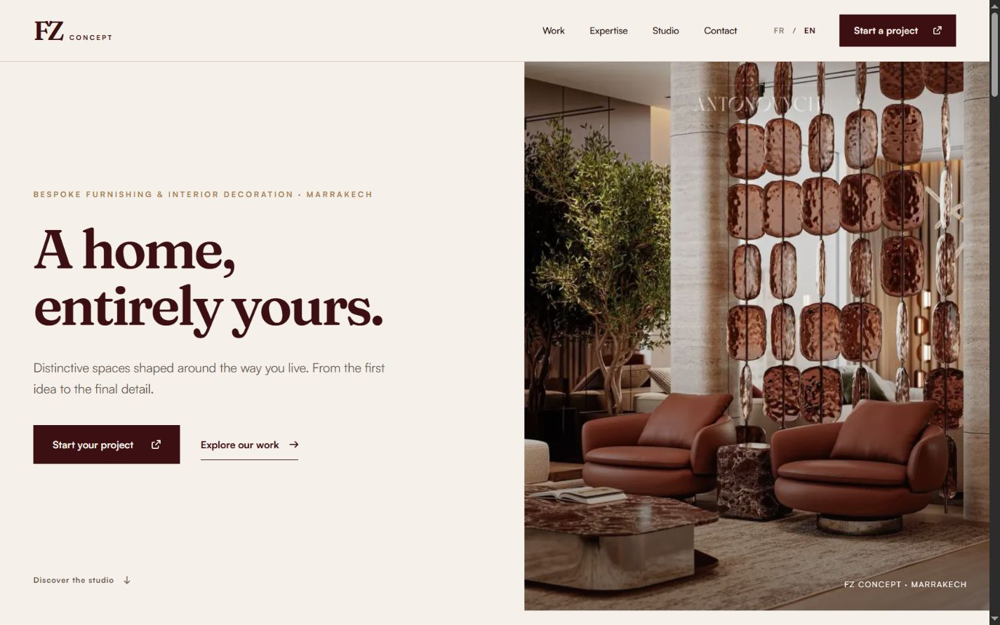

# FZ Concept

**A home, entirely yours.**

FZ Concept is a Marrakech studio for bespoke furnishing and interior decoration. This bilingual website presents the studio's approach, services, and work through an editorial visual system, then gives visitors a direct path to discuss their project.



## The experience

- **Considered art direction** — oxblood, warm paper, brass details, expressive typography, and interior photography.
- **A clear studio journey** — work, expertise, studio story, and contact pages lead from inspiration to enquiry.
- **Personal contact** — the project form stores enquiries in Neon Postgres; an authenticated studio dashboard keeps recent messages together.
- **English and French** — responsive pages, accessible controls, and reduced-motion support across the site.

## Built with

Next.js 16 · React 19 · TypeScript · Tailwind CSS 4 · GSAP · Font Awesome · Neon Postgres and Auth

## Routes

| Route | Purpose |
| --- | --- |
| `/` | Studio introduction and featured work |
| `/services` | Interior design and furnishing expertise |
| `/portfolio` | Project imagery and selected details |
| `/about` | Studio point of view and process |
| `/contact` | Project enquiry form and contact details |
| `/links` | Studio links and contact channels |
| `/privacy-policy`, `/terms-of-service` | Legal information |
| `/admin` | Studio sign-in |
| `/admin/dashboard` | Protected enquiry inbox |

## Run locally

```bash
npm install
npm run dev
```

Open [http://localhost:3000](http://localhost:3000).

The public pages run without database credentials. To use the contact form and admin inbox, copy the template and add your Neon values:

```bash
cp .env.example .env.local
```

`NEON_AUTH_COOKIE_SECRET` must contain at least 32 characters. `ADMIN_EMAIL_ALLOWLIST` is a comma-separated list of approved admin email addresses; an empty list denies dashboard access. Keep all secrets server-side. Uncomment `DATABASE_URL_UNPOOLED` in `.env.local` when you have a direct Neon connection for migrations.

Create the contact table, then provision an admin account in Neon Auth:

```bash
npm run db:migrate
```

The admin signs in at `/admin`. Contact submissions reach `POST /api/contact`; the protected dashboard reads `GET /api/admin/messages`.

### Useful commands

```bash
npm run lint        # Check the codebase
npm run build       # Create a production build
npm run start       # Serve the production build
```

## Project structure

```text
app/         Pages, API routes, metadata, and global styles
components/  Public sections, shared navigation, and admin UI
lib/         Locale, database, and authentication helpers
database/    Contact-submission migration
public/      Optimized imagery, fonts, and README preview
DESIGN.md    Visual direction and interaction rules
```

## Credits

Website designed and built by [Yassine Joundi](https://yassinejoundi.com) for FZ Concept. © 2026 FZ Concept.
